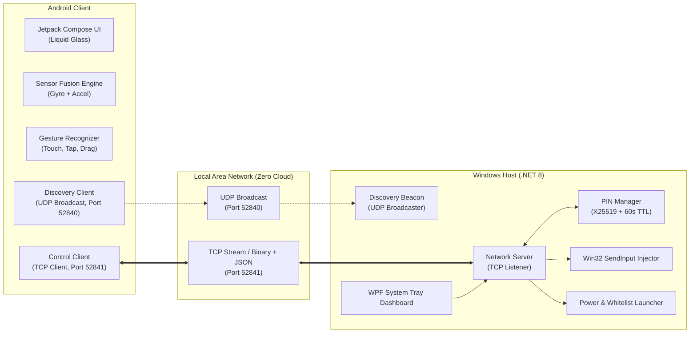

# KNOW THE MICE — System Architecture

## 1. Executive Architecture Summary

Know The Mice is a production-grade, zero-cloud remote-control ecosystem designed to allow Android smartphones to operate as high-precision wireless input peripherals (touchpad, keyboard, gyroscope air mouse, media controller, presentation clicker) for Windows PCs over a local area network (LAN).

---

## 2. Core Subsystems

### 2.1 Low-Latency Motion Framing
High-frequency mouse inputs (100+ packets/second) are packed into a 13-byte binary payload to minimize serialization overhead and avoid TCP buffer latency:
- Byte 0: Magic byte (`0x01`)
- Bytes 1-4: Delta X (`float32`, Little Endian)
- Bytes 5-8: Delta Y (`float32`, Little Endian)
- Bytes 9-10: Sequence Number (`uint16`, Little Endian)
- Byte 11: Button state flags (`uint8`)
- Byte 12: XOR Checksum (`uint8`)

### 2.2 System Tray Host Architecture
The Windows Host executes as a background desktop utility with a persistent system tray notification icon (`NotifyIcon`), minimizing to the tray on close and maintaining active TCP/UDP listeners on background worker threads.

### 2.3 Sensor Fusion Air Mouse
The Android IMU processor samples `Sensor.TYPE_GYROSCOPE` at `SENSOR_DELAY_GAME` (~50Hz). Rotational velocity around the Z and X axes is integrated through a dead-zone noise filter, providing smooth hand-waving cursor control with zero drift.
